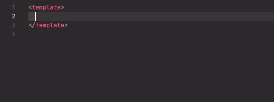

# vue-dsfr-snippets

Ensemble de snippets pour [VueDsfr](https://github.com/dnum-mi/vue-dsfr)

## Fonctionnalités

Permet de facilement utiliser les composants de VueDsfr dans les SFC Vue :

## Notes de publications

Cf. [CHANGELOG](./CHANGELOG.md)
